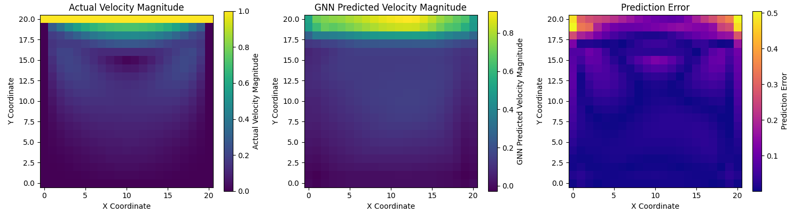
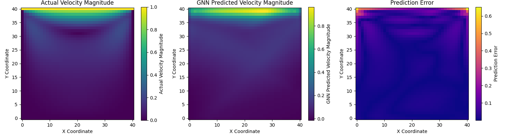
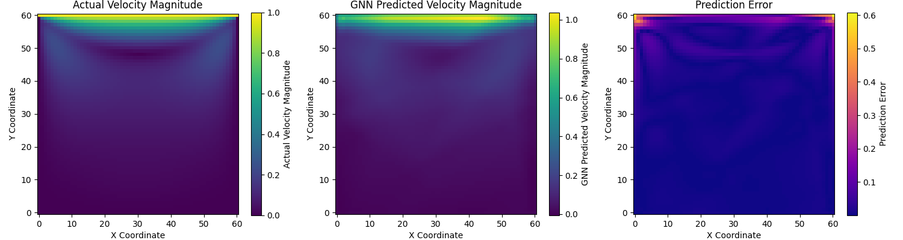
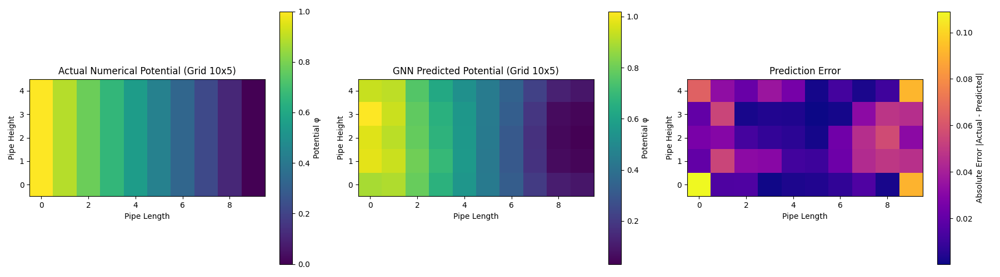
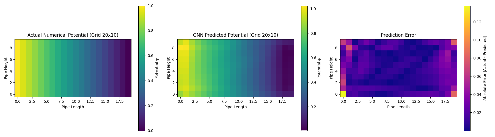
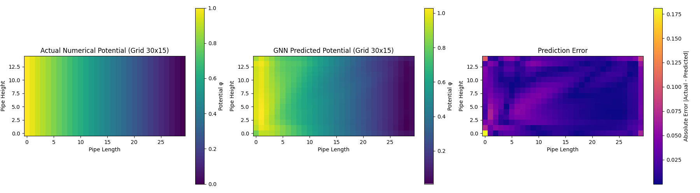

# Basic Flows: CFD + Graph Neural Networks

This folder contains two classic flow problems solved using traditional CFD solvers and enhanced with Graph Neural Networks (GNNs) for fast surrogate modeling.

---

## Problems Included

### 1. Lid-Driven Cavity Flow (`cavityFlow.py`)
- Solves the **Navier–Stokes equations** using finite difference methods.
- Computes the velocity field in a 2D square cavity where the top lid moves and induces flow.
- Converts the velocity field into a graph, where:
  - Nodes = grid points (with normalized spatial coordinates)
  - Node labels = velocity magnitudes
  - Edges = adjacency based on grid neighbors
- Trains a GCN (Graph Convolutional Network) to predict the velocity magnitude.
- Visualizes **actual vs predicted vs error**.

### 2. 2D Pipe Potential Flow (`pipeFlow.py`)
- Solves the **Laplace equation** for a 2D pipe with specified inlet/outlet conditions.
- Simulates potential flow between two plates.
- Builds a graph where:
  - Nodes = grid points with (x, y)
  - Node labels = potential value
  - Edges = horizontal/vertical grid connections
- Trains a GCN to predict the potential field.
- Outputs a comparison of actual vs predicted potential and absolute error.

---


## 🛠 How to Run

### 1️⃣ **Set up the virtual environment**
```bash
# Navigate to the basic_flows directory
cd basic_flows

# Create a virtual environment
python -m venv gnn-cfd-env

# Activate the environment
# On Windows:
gnn-cfd-env\Scripts\activate
# On macOS/Linux:
source gnn-cfd-env/bin/activate

# Install dependencies
pip install -r requirements.txt
```

---

### 2️⃣ **Run the simulations**
Run each script individually to perform the simulation, GNN training, and visualization.

```bash
python cavityFlow.py
python pipeFlow.py
```

---

## Results and Discussion

### **Cavity Flow Results**
#### Velocity Magnitude Predictions

## Results and Discussion

### **Cavity Flow Results**
#### Velocity Magnitude Predictions

| Grid Size | Numerical vs GNN vs Error |
|-----------|---------------------------|
| **21×21** |  |
| **41×41** |  |
| **61×61** |  |

#### 🔎 **Observations:**
- The **numerical simulation** captures the vortex formation inside the cavity.
- The **GNN predictions** follow the numerical results well, but some smoothing is observed.
- **Prediction errors** are more concentrated at the top corners where shear layers develop.

---

### **Pipe Flow Results**
#### Potential Field Predictions

| Grid Size | Numerical vs GNN vs Error |
|-----------|---------------------------|
| **10×5** |  |
| **20×10** |  |
| **30×15** |  |


#### **Observations:**
- The **numerical solver** provides a smooth potential field with high-to-low gradients along the pipe.
- The **GNN surrogate model** does well at approximating the general field but has some discrepancies at the boundaries.
- The **prediction error** is higher near boundary regions, possibly due to less training data available in those zones.

---

## **Conclusion**
1. **GNNs effectively approximate CFD solutions** with reasonable accuracy.
2. **Errors are highest near complex regions**, e.g., shear layers in cavity flow and boundary layers in pipe flow.
3. **Increasing grid resolution improves accuracy**, but requires more training.
4. **Potential for real-time flow estimation**, making this approach valuable for surrogate modeling in CFD applications.

---

## Contact

Feel free to reach out or open issues for improvements, enhancements, or suggestions!


